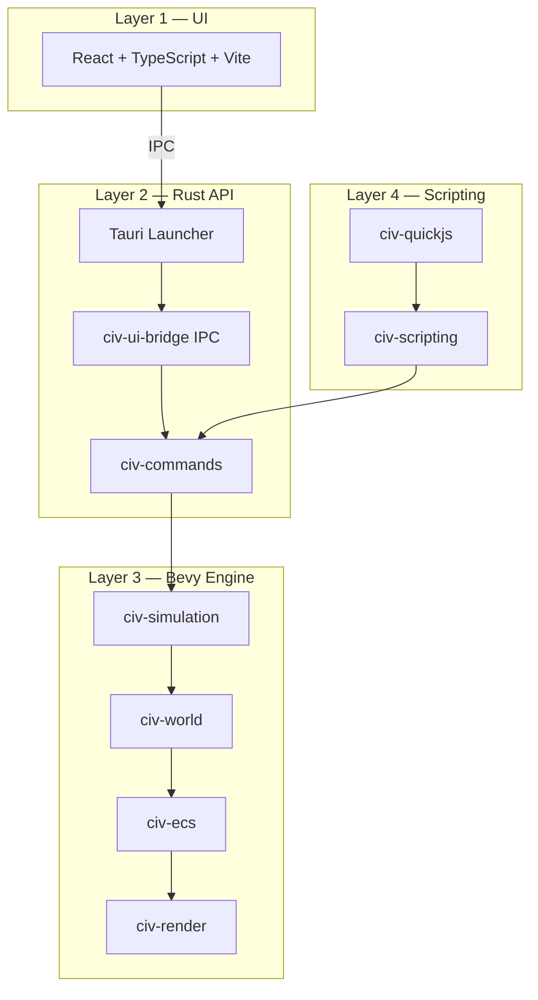

# Architecture

## Layer Model



## Data Flow

### UI Command

```
React → Tauri invoke → IpcEnvelope → UiCommand → GameCommand → SimulationState
```

### Simulation Event

```
SimulationState → GameEvent → UiBridge → UiEvent → IpcEnvelope → React poll
```

### Rendering

```
SimulationState → ECS sync → Components → Render meshes (Bevy PBR)
```

Renderer **never** mutates simulation truth.

## Crate Layers

| Layer | Crates |
|-------|--------|
| Foundation | `common`, `hex`, `world` |
| Protocol | `commands`, `events`, `ui_bridge` |
| Simulation | `simulation`, `terrain`, `pathfinding`, `save` |
| Gameplay | `gameplay`, `combat`, `movement`, `economy`, ... |
| Engine adapters | `ecs`, `render`, `assets` |
| Scripting | `scripting`, `quickjs` |
| Apps | `engine`, `launcher`, `ui` |

## Plugin Registration

All subsystems register via `EnginePluginGroup` in `engine/src/plugins/engine.rs`.

## Future-Proofing

The architecture supports these features without structural changes:

- **Multiplayer** — `civ-network` + command log in `civ-simulation`
- **Replay** — serialize `GameCommand` stream alongside `WorldMap` snapshots
- **Mods / DLC** — `civ-quickjs` + `assets/scripts/`
- **Dedicated server** — headless `civ-engine` without `civ-render`
- **Save compatibility** — `SAVE_FORMAT_VERSION` in `civ-common`
